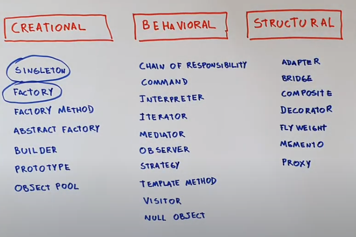

# Design patterns 

# SystemDesign prep
[leetcode-design](https://leetcode.com/tag/design/) 

Common Design patterns:
<!-- 1) [Factory Design] (uses abstract class to enforce a pattern)
2) Proxy Design (uses another derived class of same heirarchial level as an intermediate wrapper to our derived class call in a given factory design)
3) Singleton Design (uses a static class variable to store a single instance of the class and block creating multiple instances. )
4) Composite Design (a main derived class recieves other derived classes as arguments or uses them as variables)
 -->
[design patterns](https://sourcemaking.com/design_patterns)

[cpp design tutorials](https://www.youtube.com/watch?v=XyNWEWUSa5E&list=PLk6CEY9XxSIDZhQURp6d8Sgp-A0yKKDKV)
